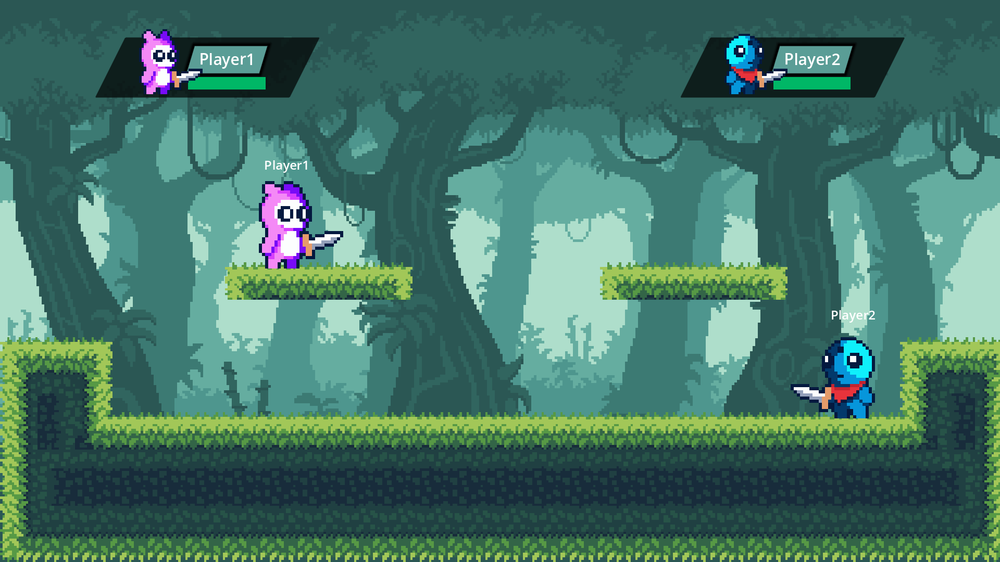

<b>The Project is made in Godot GameEngine version 4.0.3</b>

Pookie Fighters is a game where two players can fight each other.
It's a simple game. The controls are easy but the battles are exciting. 
You can choose one of several fighters. Each of which has its own special abilities. 
Battles take place in colorful and lively arenas. Perfect for a quick competition
with friends to see who's the best fighter.

## Screenshots

Here are some screenshots from the game:

## Play the Game

You can download and play Pookie Fighters on [itch.io](https://parmarmanthanrajsinh.itch.io/pookie-fighters).
